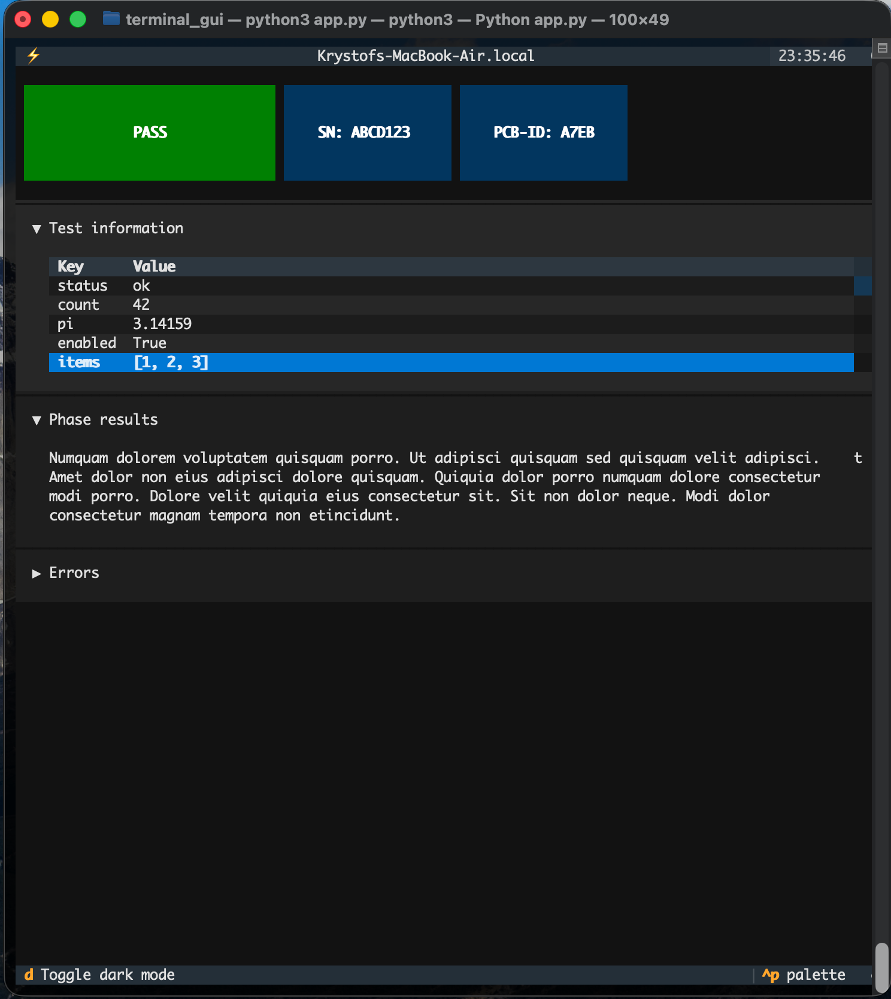

# terminal-gui demo

Showcase of `textual` library for GUI directly in terminal



## Installation

Quite often it is not simply

`pip install .[extra]`

## Usage

How to use your stuff ... API examples should go to separate files. But short commands fit right here.

`my-app -o output.yaml [SRC-FILE]`

## Configuration

If you support config files, here is the right place to list its options.


# Python Template Repository

Blueprint on getting you started fast and well.

## How we develop

Here is the end of template readme and start of tips how we develop. **TLDR;**

- use src/ layout for your projects
- keep version in `src/your-package/__version__.py` as `version="X.Y.Z"` (is updated by github CI)
- sign your commit with GPG
- lint and format with `ruff`, `pyright` on "strict"
- use "main" and "devel" branches; for feature branches DH-XYZ-description or {fix,feat}/DH-XYZ-description
- test with `pytest` because it has coverage plugin
- use given `pre-commit` for checking formatting and conventional commits
- never add `./src` to your python path - test only what is installed
- use semantic-release to get next version and changelog from commit messages
- minimal python version is always 3.10 because this is the last version supported by PySide2 and PyQT5

## Commit messages and branches naming

We use `semantic-release` that is configured by `.releaserc` and generates version numbers and changelogs
based on your [conventional commit messages](https://www.conventionalcommits.org/en/v1.0.0/). Example
messages: _"fix(ci): Correct writing results"_ or _"feat: Add configuration option --verbose"_.

Branch names are pre-configured in the file `.releaserc`:
- `main`: main release branch
- `DH-xyz-description`: if you have a JIRA ticket for which you are developing (modify for your JIRA prefix)
- `feat/description` or `fix/description` so it is clear what the branch means is supported
- `devel` - generic development pre-release branch

## How we release

There are a few choices you need to make.

- should the release process modify the version in the application? Should it commit the change into repository?
- should release be automatic on push or do you want to release manually?

This repository supports all of those - take a closer look into `.github/workflows`. To be fair - if you want
updated versions committed by the release pipeline that we cannot easily do without copying code from build
to release.

Every step of our pipeline is callable manually - for example before merging you might want to see a changelog
and the future version - just call "What is the next version?" manually on your branch. It will print out the
changelog that you can use for modifying your changelog manually.

#  Setting up your repository

First, choose `template-python` as the **Template** of your new github repository.

## Initialize your repository

```bash
$ git clone git@github.com:krystofh/your-new-repository.git
$ cd your-new-repository
$ python3 -m venv .venv && source .venv/bin/activate && pip install pre-commit
$ pre-commit install
```

We suppose that your `git` is correctly set with `email` and `gpg`. If not, please run
```
$ git config --global user.email nick@company.eu # pre-commit check correct email domain
$ git config --global commit.gpgsign true # we GPG sign our commits
$ git config --global user.signingkey $yourgpgkey # see section "Setup GPG" below
```

## Dev Tools

- **ruff** for linting and formatting (runs in dry-run mode in pre-commit hooks)
  - `ruff --fix` fixes your code like pyflake, flake8, and others (configurable) would
  - `ruff format` will isort and black your code inplace
- **mypy** turns python into typed language `mypy folder/` - we don't use mypy, we use
  `pyright` because it is built into VS Code. But it's a fat node.js binary unlike `mypy`
- **pre-commit** You can run single hook by `pre-commit run <hook-id> --all-files`.

*Tools have matching recommended VSCode extension in `.vscode` folder.*


# Guides


## Custom build

If you need to perform certain steps prior packaging your python code (such as compiling proto files)
then you can either use custom build backend or we are looking into PDM (replacement of Poetry). More
about this in `pyproject.toml`.


## Badges

Badges are cool and still hard to get right. Static badges are very easy thanks to services like [shields.io](https://shields.io/).

Dynamic badges are harder - our current way is going through GIST and using mentioned shields.io. To place an image, you need to use markdown's image tag `` as following.

```markdown

```

In order to work with our CI pipeline, you need to create a **public** gist with filename `coverage.json` and content `{}`. Subsequently, you will need a token for gists modification.
You can generate one in your Profile -> Developer Settings (the bottom-most item). Put those
two in your repository secrets

- `GIST_ID`: your public host ID is the last part of URL once you create it
- `GIST_UPDATE_TOKEN`: create token in your profile -> developer settings or reuse if you have one
